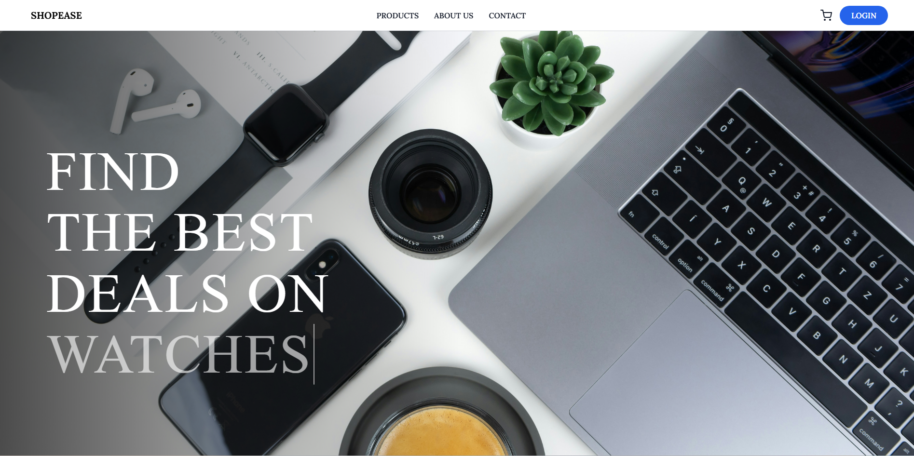
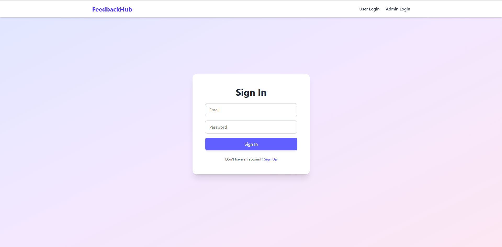
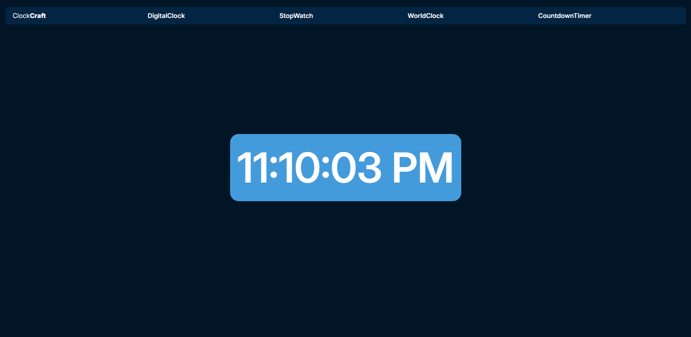

<h1 align="center">Hi 👋, I'm Jidnesh</h1>
<h3 align="center">MERN Stack Developer | Full-Stack JavaScript | Open to opportunities</h3>

## 💼 **About Me**
I'm a Full Stack Developer passionate about building **responsive, scalable web applications**. Skilled in **React, Node.js, Express, MongoDB, SQL**, and constantly exploring **AI integrations** and new technologies. I enjoy solving problems, improving user experiences, and bringing ideas to life.

---

## 🛠️ **Tech Stack**

### **Frontend:**

### **Backend:**  

### **Databases:**  

### **Tools & Platforms:**  

---

## 📌 **Featured Projects**  

|  |  |  |
|:--:|:--:|:--:|
| **[ShopEase](https://github.com/jidneshmeher/ShopEase)**   🛒 Full-stack e-commerce app with product filtering, cart, checkout, and Razorpay payments.| **[FeedbackHub](https://github.com/jidneshmeher/FeedbackHub)**   💬 Real-time feedback system with Firebase + React + Express. Includes role-based access. | **[ClockCraft](https://github.com/jidneshmeher/ClockCraft)**   ⏰ Web app with world clock, timer, alarm, and stopwatch using React + APIs. |

---

## 📊 GitHub Stats

  
  

---

## 📫 **Connect With Me**

  
  

---